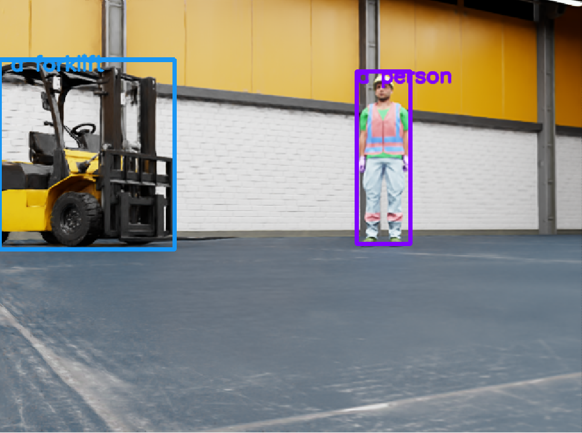
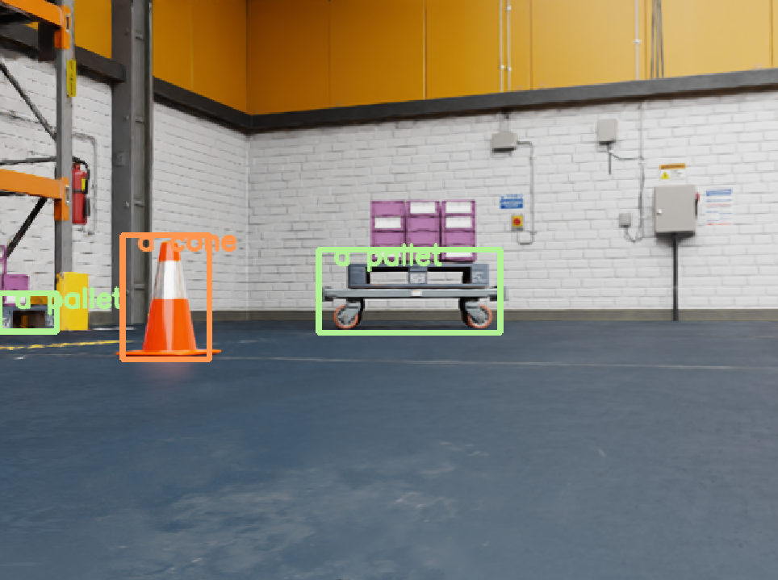
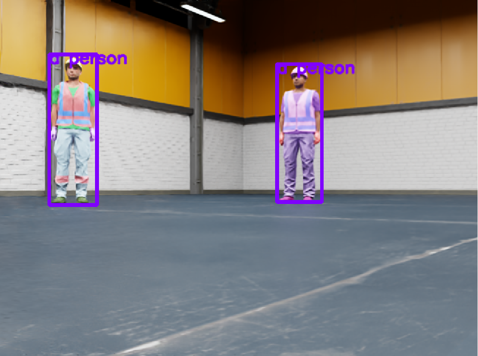
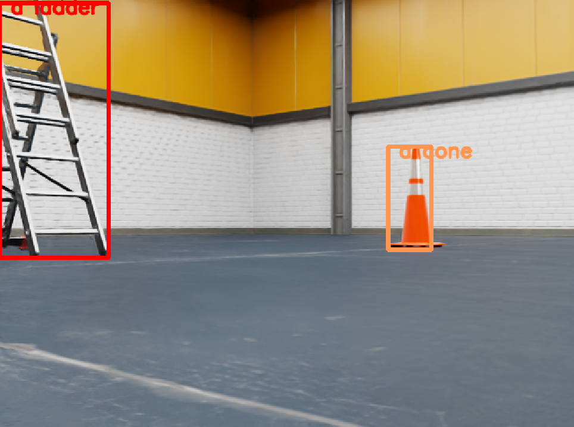
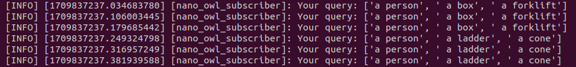
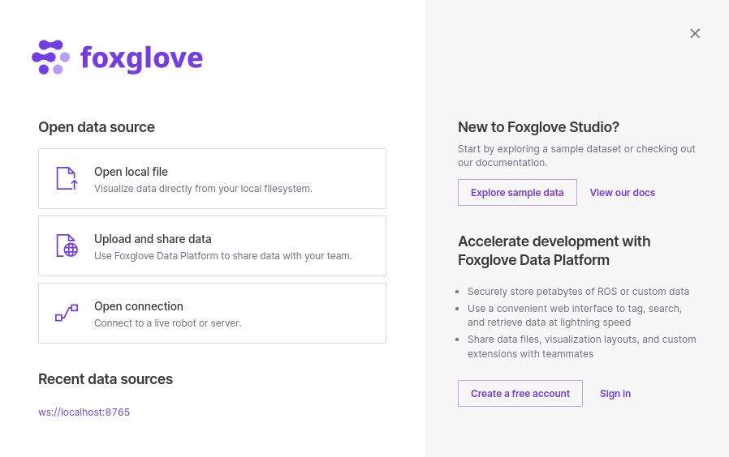
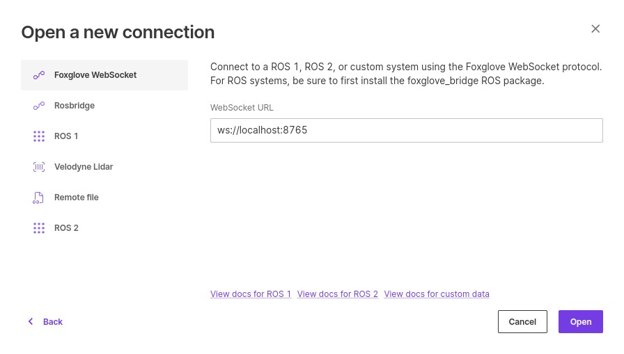
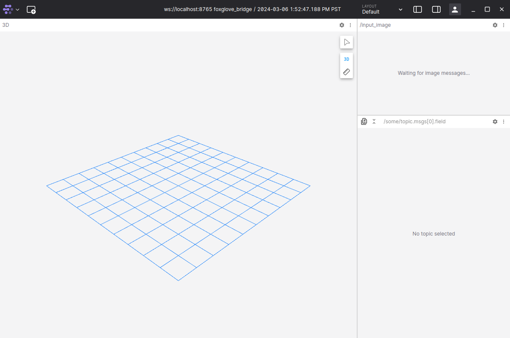
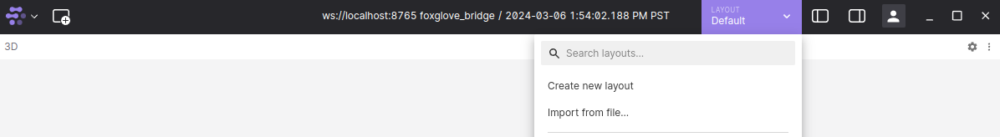
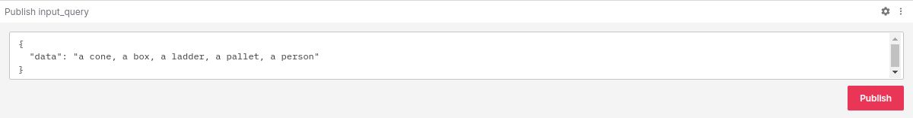

# ROS2 NanoOWL

## ROS2 node for open-vocabulary object detection using [NanoOWL](https://github.com/NVIDIA-AI-IOT/nanoowl).

[NanoOWL](https://github.com/NVIDIA-AI-IOT/nanoowl) optimizes [OWL-ViT](https://huggingface.co/docs/transformers/model_doc/owlvit) to run real-time on NVIDIA Jetson Orin with [TensorRT](https://developer.nvidia.com/tensorrt). This project provides a ROS 2 package for object detection using NanoOWL.

<p align="center">
  
&nbsp; &nbsp;
  
</p>

<p align="center">
  
&nbsp; &nbsp;
  
</p>


## Setup 

1. Set up your Isaac ROS development environment following instructions [here](https://nvidia-isaac-ros.github.io/getting_started/dev_env_setup.html).
2. Clone required projects under ```${ISAAC_ROS_WS}/src```:
```
cd ${ISAAC_ROS_WS}/src
git clone https://github.com/NVIDIA-ISAAC-ROS/isaac_ros_common.git
git clone https://github.com/NVIDIA-AI-IOT/ROS2-NanoOWL.git
git clone https://github.com/NVIDIA-AI-IOT/nanoowl
git clone https://github.com/NVIDIA-AI-IOT/torch2trt
git clone --branch humble https://github.com/ros2/demos.git
```
3. Launch the docker container using the ```run_dev.sh``` script:
```
cd ${ISAAC_ROS_WS}/src/isaac_ros_common
./scripts/run_dev.sh
```
4. Install dependencies:
   * **Pytorch**: The Isaac ROS development environment that we set up in step 1 comes with PyTorch preinstalled. Check your PyTorch version using the interactive Python interpreter by running python from terminal, and these commands:
      ```
      import torch
      torch.__version__
      ```
   * **NVIDIA TensorRT**: If you’re developing on an NVIDIA Jetson, TensorRT is pre installed as part of JetPack. Verify the installation by running python from terminal, and then this command in the interactive Python interpreter: ```import tensorrt```. If it says ‘ModuleNotFound’, try the following command and check again following the steps above:
      ```
      sudo apt-get install python3-libnvinfer-dev
      ```
      If this fails, run the following command and try again:
      ```
      sudo apt-get install apt-utils
      ```
      In case the 'ModuleNotFound' error still shows up - The python bindings to tensorrt are available in ```dist-packages```, which may not be visible to your environment. We add ```dist-packages``` to ```PYTHONPATH``` to make this work:
      ```
      export PYTHONPATH=/usr/lib/python3.8/dist-packages:$PYTHONPATH
      ```
      If ```tensorrt``` is still not installed, try the following command:
      ```
      pip install pycuda
      ```
   * **Torchvision**: Identify which version of torchvision is compatible with your PyTorch version from [here](https://pytorch.org/get-started/previous-versions/). Clone and install that specific version from source in your workspace's src folder: ```git clone –-branch <version> https://github.com/pytorch/vision.git```. For example:
      ```
      cd ${ISAAC_ROS_WS}/src
      git clone --branch v0.13.0 https://github.com/pytorch/vision.git
      cd vision
      pip install .
      ```
      Verify that torchvision has been installed correctly using the interactive Python interpreter by running python from terminal, and these commands:
      ```
      cd ../
      import torchvision
      torchvision.__version__
      ```
      If it says ‘ModuleNotFound’, try each of the following and check again following the steps above:
      ```
      sudo apt install nvidia-cuda-dev
      pip install ninja
      sudo apt-get install ninja-build
      ```
   * **Transformers library**:
      ```
      pip install transformers
      ```
   * **Matplotlib**:
      ```
      pip install matplotlib
      ```
   * **torch2trt**:
   Enter the torch2trt repository cloned in step 2 and install the package:
      ```
      cd ${ISAAC_ROS_WS}/src/torch2trt
      pip install .
      ```
   * **NanoOWL**: 
   Enter the NanoOWL repository cloned in step 2 and install the package:
      ```
      cd ${ISAAC_ROS_WS}/src/nanoowl
      pip install .
      ```
   * **cam2image**:
   We want to use the [image_tools](https://github.com/ros2/demos/tree/rolling/image_tools) package from the ```demos``` repository that we cloned to take input from an attached usb camera. Build and source this package from your workspace:
      ```
      cd ${ISAAC_ROS_WS}
      colcon build --symlink-install --packages-select image_tools
      source install/setup.bash
      ```
      Verify that the cam2image node works by running the following command in a terminal and viewing topic ```/image``` in RViz/Foxglove from another terminal:
      ```
      ros2 run image_tools cam2image
      ```
5. Build ros2_nanoowl:
```
cd ${ISAAC_ROS_WS}
colcon build --symlink-install --packages-select ros2_nanoowl
source install/setup.bash
```
6. Build the TensorRT engine for the OWL-ViT vision encoder - this step may take a few minutes:
```
cd ${ISAAC_ROS_WS}/src/nanoowl
mkdir -p data
python3 -m nanoowl.build_image_encoder_engine data/owl_image_encoder_patch32.engine
```
Copy this ```data``` folder with the generated engine file to the ROS2-NanoOWL folder:
```
cp -r data/ ${ISAAC_ROS_WS}/src/ROS2-NanoOWL
```
7. Run the image publisher node to publish input images for inference. We can use the sample image in ```${ISAAC_ROS_WS}/src/nanoowl/assets/```:
```
cd ${ISAAC_ROS_WS}
ros2 run image_publisher image_publisher_node src/nanoowl/assets/owl_glove_small.jpg --ros-args --remap /image_raw:=/input_image
```
8. You can also play a rosbag for inference. Make sure to remap the image topic to ```input_image```. For example:
```
ros2 bag play <path-to-rosbag> --remap /front/stereo_camera/left/rgb:=/input_image
```
9. From another terminal, publish your input query as a list of objects on the ```input_query``` topic using the command below. This query can be changed anytime while the ```ros2_nanoowl``` node is running to detect different objects. Another way to publish your query is through the ```publish``` panel in [Foxglove](https://foxglove.dev/) (instructions given below in this repository).
```
ros2 topic pub /input_query std_msgs/String 'data: a person, a box, a forklift'
``` 
10. Run the launch file to start detecting objects. Find more information on usage and arguments below:
```
ros2 launch ros2_nanoowl nano_owl_example.launch.py thresholds:=0.1 image_encoder_engine:='src/ROS2-NanoOWL/data/owl_image_encoder_patch32.engine'
```
11. The ```ros2_nanoowl``` node prints the current query to terminal, so you can check that your most recent query is being used:


   If an older query is being published, please update it:
   * If using Foxglove: Check that the query on the panel is correct and click the Publish button again. Remember to click the Publish button everytime you update your query!
   * If using command line: Rerun the ```ros2 topic pub``` command (given in  step 9) with the updated query. 
12. Visualize output on topic ```/output_image``` using RVIZ or Foxglove. Output bounding boxes are published on topic ```/output_detections```.
13. To perform inference on a live camera stream, run the following launch file. Publish a query as given in step 9:
```
ros2 launch ros2_nanoowl camera_input_example.launch.py thresholds:=0.1 image_encoder_engine:='src/ROS2-NanoOWL/data/owl_image_encoder_patch32.engine'
```
 
## Usage

```ros2 launch ros2_nanoowl nano_owl_example.launch.py thresholds:=<threshold-value> image_encoder_engine:=<path-to-encoder-engine>```

## ROS Parameters

| ROS Parameter | Type | Default | Description |
| --- | --- | --- | --- |
| thresholds | float | 0.1 | Threshold for filtering detections |
| image_encoder_engine | string | "src/ROS2-NanoOWL/data/owl_image_encoder_patch32.engine" | Path to the TensorRT engine for the OWL-ViT vision encoder |

## Topics Subscribed

| ROS Topic | Interface | Description |
| --- | --- | --- |
| input_image | [sensor_msgs/Image](https://github.com/ros2/common_interfaces/blob/humble/sensor_msgs/msg/Image.msg) | The image on which detection is to be performed |
| input_query | [std_msgs/String](https://github.com/ros2/common_interfaces/blob/humble/std_msgs/msg/String.msg) | List of objects to be detected in the image |

## Topics Published

| ROS Topic | Interface | Description |
| --- | --- | --- |
| output_image | [sensor_msgs/Image](https://github.com/ros2/common_interfaces/blob/humble/sensor_msgs/msg/Image.msg) | The output image with bounding boxes and labels around detected objects |
| output_detections | [vision_msgs/Detection2DArray](https://github.com/ros-perception/vision_msgs/blob/ros2/vision_msgs/msg/Detection2DArray.msg) | Output detections including bounding box coordinates and label information for each detected object in the image |

## Using Foxglove for visualization and publishing queries

1. [Download](https://foxglove.dev/download) and install Foxglove on your Jetson.
2. Open Foxglove and click on **Open connection**.

3. Click on the **Foxglove WebSocket** option - it tells you to connect to your system using the [Foxglove Websocket](https://docs.foxglove.dev/docs/connecting-to-data/frameworks/ros2#foxglove-websocket) protocol. This option requires running an extra ROS node called the **foxglove_bridge**.

4. Follow instructions on installing and launching the [Foxglove bridge](https://docs.foxglove.dev/docs/connecting-to-data/ros-foxglove-bridge).
5. Once you’ve successfully launched foxglove_bridge in a terminal, Foxglove should connect to your system and show the default layout.

6. Use the **Import from file** option to import the **NanoOWL_Layout.json** file included in this repository.

7. From the panel at the bottom, you can publish and update queries to the ros2_nano_owl node. Type in the objects you want to detect and click on the red Publish button to start inference!
 

## Resources

1. [NanoOWL](https://github.com/NVIDIA-AI-IOT/nanoowl) - A project that optimizes OWL-ViT for real-time inference with NVIDIA TensorRT.
2. [Torch2trt](https://github.com/NVIDIA-AI-IOT/torch2trt) - An easy to use PyTorch to TensorRT converter.
